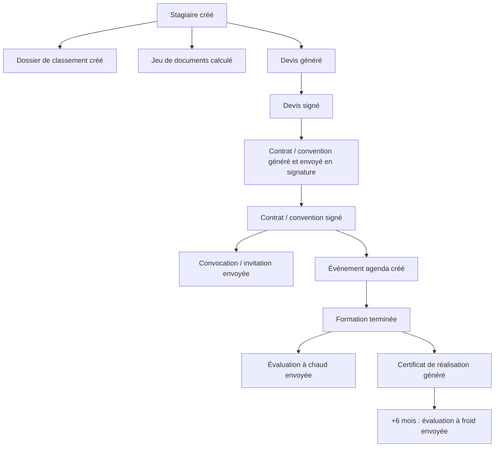

# Spécification fonctionnelle

## Vue globale du projet

- **Nom du projet :** Impastio
- **Client :** École Pizzaïolo Jean-Jacques Despaux (« École Pizza »)
- **Chef de projet :** Guillaume Despaux
- **Document créé le :** 06/07/2026
- **Dernière modification :** 06/07/2026

## Table des matières

- [Spécification fonctionnelle](#spécification-fonctionnelle)
  - [Vue globale du projet](#vue-globale-du-projet)
  - [Table des matières](#table-des-matières)
  - [Introduction](#introduction)
  - [Objectifs](#objectifs)
  - [Portée](#portée)
    - [Gestion des stagiaires (CRM)](#gestion-des-stagiaires-crm)
    - [Génération documentaire](#génération-documentaire)
    - [Signature électronique](#signature-électronique)
    - [Émargement et suivi](#émargement-et-suivi)
    - [Suivi Qualiopi](#suivi-qualiopi)
    - [Facturation et ventes](#facturation-et-ventes)
    - [Partenaires](#partenaires)
    - [Espaces dédiés (extranets)](#espaces-dédiés-extranets)
  - [Hors de portée](#hors-de-portée)
  - [Rôles et accès](#rôles-et-accès)
  - [Catalogue des formations](#catalogue-des-formations)
  - [Exigences fonctionnelles](#exigences-fonctionnelles)
    - [Application web](#application-web)
    - [Base de données](#base-de-données)
    - [Automatisations](#automatisations)
    - [API](#api)
  - [Exigences non fonctionnelles](#exigences-non-fonctionnelles)
    - [Performances](#performances)
    - [Sécurité](#sécurité)
    - [Conformité](#conformité)
    - [Ergonomie](#ergonomie)
  - [Cas d'usage](#cas-dusage)
  - [Suppositions et contraintes](#suppositions-et-contraintes)
  - [Glossaire](#glossaire)

## Introduction

L'École Pizzaïolo Jean-Jacques Despaux est un centre de formation pizzaïolo
certifié Qualiopi, situé à Lannemezan (65). Il forme des personnes de tout âge,
principalement en reconversion professionnelle. L'effectif administratif est
réduit : 1 à 2 formateurs et 1 secrétariat.

Aujourd'hui, la gestion s'appuie sur un assemblage manuel d'outils Google
(Sheets pour les données, Docs pour les modèles de documents, Forms pour les
tests et les avis des stagiaires). Ce fonctionnement est chronophage et fragile.
Impastio remplace cet assemblage par une application unique et cohérente.

## Objectifs

Faciliter et fiabiliser le travail du secrétariat en automatisant les tâches
répétitives. Concrètement, l'application doit permettre de :

- centraliser les dossiers stagiaires et suivre leur avancement ;
- générer automatiquement les documents administratifs à partir de modèles ;
- faire signer ces documents électroniquement ;
- suivre l'émargement et la présence ;
- suivre la conformité Qualiopi de chaque dossier ;
- envoyer automatiquement les e-mails aux étapes clés ;
- gérer la facturation.

Le tout à un coût nettement inférieur aux solutions du marché (ex. Digiforma, à
partir d'environ 200 €/mois), et de façon simple à prendre en main sans formation.

## Portée

L'application est d'abord destinée à l'École Pizza, mais elle est conçue pour être
clonable pour d'autres organismes ayant le même besoin (architecture
multi-organisme). Elle couvre les fonctionnalités suivantes.

### Gestion des stagiaires (CRM)

- Créer, rechercher et modifier les fiches stagiaires.
- Suivre chaque inscription (le « dossier ») dans un pipeline, du prospect à
  l'archivage, avec des notes de suivi.
- Rattacher un stagiaire à une session de formation et à un financement
  (particulier ou professionnel).

### Génération documentaire

- Produire automatiquement les documents d'un dossier à partir de **24 modèles
  Word réels** : devis, contrats, conventions, convocations/invitations, droit à
  l'image, feuilles d'émargement, attestation hygiène, certificat de réalisation,
  CGV, fiche semaine, évaluations.
- Le bon modèle est choisi automatiquement selon la formation et le type de
  financement (par exemple : Devis Particulier vs Devis Entreprise vs Devis
  RS7404 ; Contrat pour un particulier, Convention pour un professionnel).
- Chaque document est rempli avec les données du dossier, converti en PDF, nommé
  et classé automatiquement.

### Signature électronique

- Envoyer les documents à signer (devis, contrat/convention, droit à l'image) et
  récupérer le PDF signé accompagné de son dossier de preuve.
- Niveau de signature et mode d'authentification adaptés au type de document
  (par exemple OTP par e-mail pour un devis, OTP par SMS pour un contrat).

### Émargement et suivi

- Gérer les feuilles d'émargement par demi-journée.
- Enregistrer la présence signée (horodatage, signature).

### Suivi Qualiopi

- Suivre, pour chaque dossier, la présence des pièces obligatoires (programme,
  devis signé, convention/contrat signé, convocation, test de positionnement,
  émargement, évaluations à chaud et à froid, certificat, preuves financeur…).
- Afficher un **score de conformité** (vert / orange / rouge) par dossier.
- Exporter la liste des preuves pour un audit.

### Facturation et ventes

- Gérer devis, acomptes, factures et avoirs, avec gestion de l'exonération de TVA.
- Suivre les paiements.

### Partenaires

- Tenir l'annuaire des partenaires de l'école (23 partenaires), avec filtres par
  catégorie et gestion de contrats partenaires.

### Espaces dédiés (extranets)

- Espace stagiaire : accès aux ressources pédagogiques de son niveau/spécialisation
  et à son dossier.
- Espace entreprise / financeur / auditeur : suivi des dossiers concernés.

## Hors de portée

- **Recrutement** : l'application ne recherche pas de nouveaux stagiaires pour
  l'école.
- **Application mobile native** : seule une web app responsive est prévue, pas
  d'application iOS/Android dédiée.
- **Gestion RH des entreprises clientes** : paie, contrats de travail, gestion du
  personnel ne sont pas pris en charge.
- **Intégration native ERP/CRM/comptabilité tiers** : pas de synchronisation
  directe avec des logiciels externes au-delà des intégrations prévues (Google,
  Yousign, Stripe).
- **Personnalisation avancée** : les modèles de documents et les workflows ne sont
  pas personnalisables au-delà des champs et règles prévus.
- **Multilingue** : l'application est en français uniquement.
- **Gestion des financements publics** (OPCO, CPF…) : non prise en charge dans le
  périmètre initial.

## Rôles et accès

| Rôle | Description | Accès principal |
|---|---|---|
| **Super administrateur** | Exploitation technique (éditeur du logiciel). | Tout |
| **Administrateur** | Responsable de l'organisme. | Tout l'organisme |
| **Secrétariat** | Gestion quotidienne. | Dashboard, stagiaires, sessions, documents, suivi, réglages |
| **Formateur** | Suivi pédagogique. | Dashboard, stagiaires, sessions, calendrier, formations |
| **Stagiaire** | Accès à son dossier et aux ressources de son niveau. | Espace personnel |
| **Entreprise** | Suivi des employés inscrits. | Suivi des dossiers concernés |
| **Financeur** | Suivi des dossiers financés. | Suivi |
| **Auditeur** | Contrôle Qualiopi. | Suivi, audit |

> Chaque donnée est cloisonnée par organisme : un utilisateur ne voit que les
> dossiers de son organisation.

## Catalogue des formations

Neuf formations sont gérées :

| Code | Intitulé | Jours | Heures | Prix |
|---|---|:-:|:-:|:-:|
| NIV1 | Pizzaïolo Niveau I – Pizza Classique | 5 | 35 | 1 480 € |
| NIV1H | Niveau I – Pizza Classique & Hygiène alimentaire | 5 | 44 | 1 780 € |
| NIV1PRO | Pizzaïolo Niveau I PRO – Pizza Classique | 2 | 15 | 850 € |
| NIV2 | Niveau II – Empâtements Indirects « Poolish - Biga » | 2 | 15 | 850 € |
| NIV2C | Niveau II – Empâtements Indirects « Poolish - Biga - Contemporaine » | 3 | 21 | 1 180 € |
| EXPERT | Spécialisation « Expert » | 4 | 32 | 1 650 € |
| NAPO | Spécialisation Pizza Napolitaine | 5 | 35 | 1 750 € |
| TEGLIA | Spécialisation « In Teglia & In Pala » | 2 | 14 | 850 € |
| RS7404 | Fabriquer des pizzas artisanales (RS7404) — certifiante | 5 | 35 | 1 750 € |

## Exigences fonctionnelles

### Application web

L'application est une **web app responsive** accessible depuis un navigateur, sans
installation. Elle est pensée en priorité pour un usage sur ordinateur, mais reste
utilisable sur tablette et smartphone.

### Base de données

Une base de données centralise toutes les informations nécessaires :

- **Organisme** : identité légale (raison sociale, SIRET, numéro de déclaration
  d'activité, NAF, adresse, contacts) et paramètres d'intégration.
- **Stagiaires** : informations personnelles, documents transmis et reçus,
  résultats, historique.
- **Entreprises / financeurs** : coordonnées et représentant (pour la convention).
- **Formations** : code, durée, heures, prix, prérequis, hygiène, code RS.
- **Sessions** : année et semaine ISO, formateur, dates, statut.
- **Inscriptions (dossiers)** : financement, étape CRM, conformité.
- **Documents** : modèles, documents générés (statut, numéro, données de fusion).
- **Signatures** : demandes et signataires, preuve.
- **Émargement** : feuilles et présences signées.
- **Facturation** : factures et paiements.
- **Évaluations** : positionnement, formative, satisfaction, financeur, manageur.
- **Qualiopi** : pièces justificatives et statut.
- **Journal d'audit** et **notifications**.

Le détail du modèle de données figure dans la
[spécification technique](../technical/technical_specification.md).

### Automatisations

Le parcours d'un dossier déclenche automatiquement des actions à chaque étape :

### API

Une API REST, cloisonnée par organisme, relie la base de données à l'application
et permet un accès externe contrôlé (par clé d'API). Chaque action sensible est
journalisée.

## Exigences non fonctionnelles

### Performances

L'affichage des informations doit être rapide et fluide, y compris sur des postes
peu puissants. L'application doit rester légère au chargement.

### Sécurité

- Authentification par e-mail et mot de passe.
- Cloisonnement strict des données par organisme (multi-tenant).
- Secrets (clés d'intégration) conservés uniquement côté serveur, jamais exposés
  au navigateur.
- Webhooks vérifiés cryptographiquement (HMAC).
- Journal d'audit sur chaque action sensible.

### Conformité

- **RGPD** : les données personnelles (photos, contrats réels) restent hébergées
  côté client et ne sont jamais versées dans le dépôt de code.
- **Qualiopi** : les documents et le suivi respectent le référentiel national
  qualité.
- **Facturation électronique** : anticipation du format Factur-X (PDF + XML).

### Ergonomie

- Interface simple, compréhensible par une personne non technique.
- Responsive (ordinateur en priorité, tablette et smartphone pris en charge).
- Bascule de thème (four à bois / semoule).

## Cas d'usage

| Nom | Âge | Rôle | Description |
|---|:-:|---|---|
| Sylvie | 45 | Secrétaire | Seule au secrétariat, elle gère de nombreux dossiers par semaine et veut arrêter de recopier des données entre Sheets, Docs et Forms. |
| Christian | 34 | Stagiaire (électricien en reconversion) | Peu organisé, il veut suivre son dossier et récupérer ses documents sans relancer le secrétariat. |
| Jean-Pierre | 50 | Chef d'entreprise | Il inscrit des salariés, suit leur progression et veut une facturation groupée simple. |

## Suppositions et contraintes

**Suppositions**

- Les utilisateurs disposent d'une connexion Internet stable.
- Les utilisateurs possèdent une adresse e-mail valide (authentification,
  communication).
- Les postes utilisés sont modernes et compatibles avec un navigateur récent.

**Contraintes**

- Pas d'application native mobile (web app uniquement).
- Sécurité des données conforme au RGPD.
- Automatisations (e-mails, génération de documents, signatures) sans
  intervention manuelle.
- Accès administrateur étendu strictement réservé et tracé.

## Glossaire

- **Dossier (Enrollment)** : inscription d'un stagiaire à une session ; c'est
  l'unité de suivi (financement, étape CRM, conformité).
- **CRM** : suivi commercial du prospect à l'archivage.
- **Template / modèle** : document Word préformaté servant à générer les documents
  du dossier.
- **Jeton** : champ variable d'un modèle (ex. `{Prix}`) remplacé par une donnée du
  dossier.
- **Émargement** : feuille de présence signée par demi-journée.
- **Qualiopi** : certification qualité obligatoire pour les organismes de
  formation financés.
- **Score de conformité** : indicateur vert / orange / rouge de complétude d'un
  dossier.
- **Factur-X** : format de facture mêlant PDF et XML pour la facturation
  électronique.
- **Multi-tenant** : architecture où plusieurs organismes cohabitent avec des
  données cloisonnées.
- **Webhook** : notification automatique envoyée par un service tiers (ex. retour
  de signature).
- **OTP** : code à usage unique (par e-mail ou SMS) pour authentifier un signataire.
- **Web app** : application accessible depuis un navigateur, sans installation.
